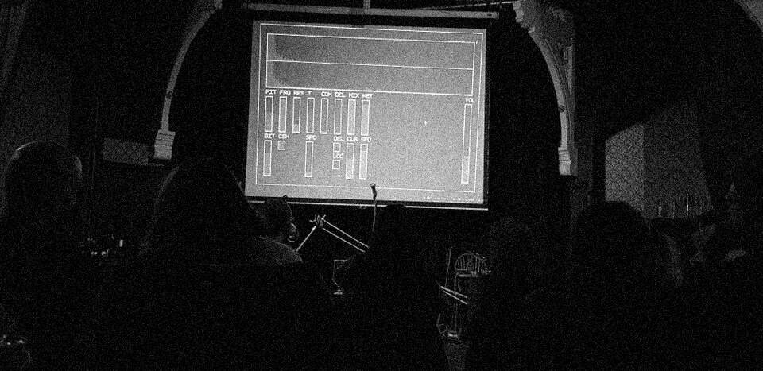

# compakt

an audio/gui/midi library made in c, designed for quick audio prototyping and performance

  

## dependencies
- sdl2 + sdl2_image (gui)
- jack (audio)
- portmidi (midi)
- fftw3 (fft)

## structure
- gui: every custom widget is a struct that contains a widget base object. it is then stored in a global void* array, and cast to a widget* for performing events (like drawing, mouse clicks, etc). callbacks are simply function pointers set by the custom widget. there is also a gui_callback function which is called every frame, and can be used for drawing or general updates
- audio: all audio structs are managed by you. there are utilities for dealing with "samples", which is just a struct containing 2 floats (left and right). audio_callback is responsible for filling each block with new data
- midi: basic midi support using portaudio. all the current midi values are stored in a struct, but there is also a midi_calback which is called whenever a value changes
- fft: basic fftw implimentation, FFT_SIZE number of reals go in, FFT_HALF_SIZE number of complex numbers go out
